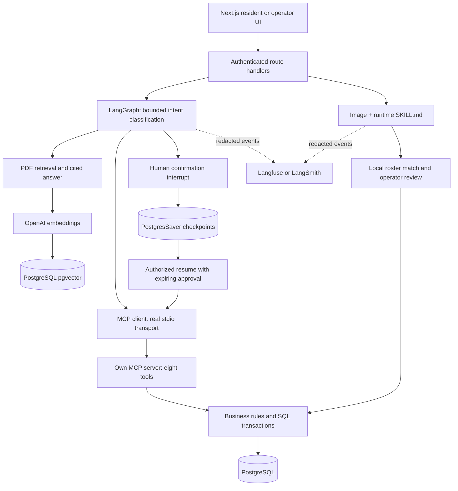

# Liam Concierge architecture

This repository is a standalone nFactorial demonstration. It contains fictional fixtures and policy text; no property data or approval is implied.

## Request flow

## Agent and deterministic actions

`src/lib/assistant/graph.ts` implements branching, tool steps and persisted interruption. The model chooses a structured intent, not unrestricted tool calls. Resident requests can query packages, expected shipments and windows; request delivery; ask policy questions; or receive a refusal. Operator-only intents add room capacity, aging and exceptions. Direct guided buttons use the same graph without LLM processing. Package details and round previews are also accessible through the operator tool workspace.

Booking reads packages and windows, stores a PostgreSQL checkpoint, then interrupts. The authenticated resume endpoint validates that the selected package/window were offered and issues a ten-minute approval. The MCP tool rechecks the session, role, parcel ownership and approval. SQL row locks and shared limits prevent overbooking. Consuming an approval and scheduling its package happen in the same transaction. A repeated request returns the original result. Recovery reads the current parcel status rather than inventing a new booking.

The prototype supports a single one-hour window per service date, 1–10 resident stops, up to 20 parcels / 150 lb per window, up to three parcels per resident and a 30-minute booking cutoff. Individual parcels must weigh more than zero and at most 25 lb. These are demonstration rules, not approved commercial commitments.

## Why MCP and where ordinary APIs remain

MCP provides a typed tool catalog, discovery, structured inputs/results, and a separate server process usable by an agent client. The app actually uses `Client` / `StdioClientTransport` and `McpServer` / `StdioServerTransport`; this is not a collection of functions merely named MCP. Capability tokens are session-bound, hashed in the database, expire after five minutes and are removed when the client closes. Every tool call rechecks authority.

Ordinary HTTP endpoints remain appropriate for the UI, OAuth and uploads. Gmail still uses Google's API. Occupancy is arithmetic over recorded inspections; MCP exposes the result and does not measure a room. Weight comes from a declared scale, printed label, estimate or unverified entry. No carrier API is assumed to reveal weight or courier GPS.

The current MCP server is local stdio. A remote ChatGPT/Claude connector requires a separately designed HTTP transport, user authorization and hosting; this submission does not claim that connector exists.

## PDF RAG

`knowledge/liam-demo-policy.pdf` contains eight demonstration sections. `pdftotext -layout` parses the real PDF. The indexer splits by page (default, eight chunks), or into 550-character windows with 100-character overlap (24 chunks). OpenAI `text-embedding-3-small` produces 256-dimensional embeddings stored in `public.vector(256)`. Corpus records include page, version, source ID and document SHA-256. Exact same document/variant avoids re-embedding.

Retrieval uses cosine similarity, up to four chunks and a 0.25 minimum score. An answer supplies `supported` and `source_ids`; unknown IDs or unsupported answers become an abstention. The UI shows excerpts and links to the source PDF page. Source membership checks do not guarantee entailment; evaluations include citation, faithfulness and relevance checks. There is no semantic response cache or automatic fallback model.

## Vision and Skill

ZXing decodes a barcode locally when possible. Only after consent does OpenAI receive the selected image. The server loads `skills/liam-parcel-exceptions/SKILL.md` at runtime and includes its instructions in the structured vision call. Missing fields remain nullable. Name-plus-unit matching against the verified roster happens locally; the roster is not sent to the model. An operator reviews and may correct a draft before confirming intake. Duplicate intake is prevented by a unique tracking reference and transactional draft consumption. Tracking-only barcodes cannot reliably provide the recipient and weight.

The source image is not stored in PostgreSQL or traces. Extracted fields/drafts are stored privately; drafts expire for confirmation after 24 hours. Expiration does not automatically delete the database record. Existing operational data has no automated retention purge in this prototype.

## Email, privacy and isolation

Residents choose manual tracking, one pasted notice or optional Gmail OAuth with PKCE and read-only access. Gmail authorization is separate from sign-in. The Gmail scope technically permits reading mailbox content; a narrow search query is an application filter, not a narrower OAuth permission. Tokens are encrypted with a server-only key and bound to their owner. Sync extracts supported shipping references, excludes attachments and deduplicates records. Disconnect removes Gmail-only notices and attempts token revocation. It does not erase manual entries.

Expected shipment notices never establish physical custody. The app cannot order products, access another resident's inbox, track couriers live or guarantee arrival forecasts. The real Gmail account flow still needs Google OAuth setup and user authorization. Automated Google integration tests use mocks.

## Observability and security

Every explicit LLM and embedding call uses the tracing wrapper. Langfuse is the verified backend; LangSmith is an alternative. Traces include step names, version, model settings and token counts, with explicit redacted inputs/outputs. Auto-instrumentation of model payloads is disabled; images are not uploaded to tracing. The authenticated browser keeps conversation history and checkpoints in the private database. An interrupted/resumed request can produce separate traces correlated by application history rather than a single trace spanning human wait time.

Sessions are hashed, HTTP-only and SameSite; mutations check Origin. Role and verified-residency checks apply server-side. Body and request limits bound uploads/actions. Custody events and room inspections are append-only. The demo is single-community and single-owner; it is not a completed multi-tenant production service.

## Deployment model

Node.js 26, PostgreSQL 16 with pgvector, and Poppler are required. The MCP server spawns a local Node process, so deploy the full repository on a persistent Node host with its dependencies. A generic edge/serverless upload is insufficient without adapting process execution and data persistence. The included CI checks use isolated schemas and no paid AI calls. Public hosting is not included in this submission.

## Deliberate technology choices

LangGraph supplies explicit conditional edges, PostgreSQL checkpoints and resumable interrupts for a workflow that must stop before booking. A plain API/state machine could serve the operational workflow, but would not meet the course's agent-orchestration requirement; CrewAI/Parlant were not benchmarked here. The chosen graph makes the confirmation boundary inspectable with few moving parts.

pgvector shares the already-required PostgreSQL service with records and checkpoints, avoiding a second database for eight pages. Exact cosine search is adequate for this small corpus; a large corpus would need indexing and a separate retrieval benchmark. The embedding model is a low-cost hosted choice; 256 dimensions reduce stored vectors, but dimension alternatives were not measured. Chunking alternatives were measured rather than claimed to be universally optimal.

OpenAI provides the structured text and image interfaces used by the application. Two accessible models were compared on separate development examples; there is no claim of a cross-provider benchmark. See EVALS.md for quality, latency and estimated generation cost. Guided actions keep operational queries usable when AI is unavailable, while AI-only features fail visibly. This is an explicit non-AI path, not an automatic fallback model.
