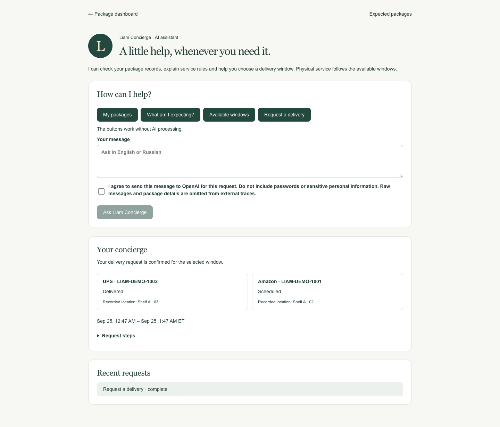

# Liam Concierge — nFactorial Final Project

[](https://github.com/arzhan-hub/liam-concierge-nfactorial/actions/workflows/ci.yml)

A package concierge application for residents and operators. The resident can check personal packages, ask service-rule questions and confirm a delivery request. The operator can review a label photo, record intake, inspect room occupancy and find aging packages. AI assists with language, images and policy retrieval; authenticated business rules control custody and booking.

This is an independent student demonstration. **All committed examples are fictional.** No property approval, insurance coverage or live resident service is implied.



## Run locally

Requirements: **Node.js 26+, PostgreSQL 16 commands on PATH, pgvector installed for that PostgreSQL version, Poppler (`pdftotext`)**. A local PostgreSQL cluster is created under ignored `.local/`, listening only on `127.0.0.1:55433`. It is separate from any existing Liam Concierge database.

```sh
npm ci
npm run demo:setup
npm run dev
```

Open http://localhost:3000. The setup command creates fictional operator and resident accounts. Open `.local/demo-access.txt` locally for the generated password; it is not a shared public credential. Accounts: `owner@example.test`, `avery@example.test`, `morgan@example.test`. Rerunning setup preserves existing records and opens a future window if none is available. `npm run demo:stop` stops this isolated database.

On macOS, PostgreSQL and Poppler can be installed with Homebrew. pgvector must match the `pg_config` for your PostgreSQL installation; verify `CREATE EXTENSION vector` works in a disposable database. On Linux use your PostgreSQL distribution's pgvector package. For an existing disposable database, manually set `.env.local` from `.env.example`, set `DEMO_MODE=true`, `LIVE_OPERATIONS=false` and a random `DEMO_PASSWORD` of at least 16 characters, then run `npm run demo:seed`. Seed refuses a database with a non-demo owner. Do not point it at a production database.

Guided package queries, confirmed booking, manual intake and room checks work without AI keys. To enable real AI, edit **`.env.local` only**, adding OpenAI and Langfuse settings from [AI_SETUP.md](AI_SETUP.md). Then:

```sh
npm run rag:index
```

Restart the app after changing settings. AI requests require a consent checkbox. Paid evaluation commands use the configured APIs; normal tests do not.

## Demonstration

[Watch the recorded browser demo](docs/demo/resident-demo.webm): fictional resident booking, persisted confirmation and a real cited AI answer. This is a recording; a public hosted application URL is not available.

- `/concierge`: personal package tools, EN/RU intent classification, persisted confirmation and cited PDF answers.
- `/label-intake`: owner-only image extraction, runtime Skill, local recipient suggestions and explicit intake confirmation.
- `/operations`: actual MCP tools for room occupancy, age, exceptions, weight details and delivery preview.
- `/mail`: manual tracking or one shared delivery notice; optional personal Gmail authorization.
- `/presentation`: twelve-slide defense outline; [PDF for submission](public/defense/Liam_Concierge_nFactorial.pdf) and [editable PowerPoint](public/defense/Liam_Concierge_nFactorial.pptx).

Follow [DEMO.md](DEMO.md) for the eight-minute defense and exact test inputs. Gmail setup is separate: [GMAIL_SETUP.md](GMAIL_SETUP.md). A real mailbox has **not** been verified; integration tests mock Google's responses.

## Requirement evidence

| Requirement | Implementation / evidence |
|---|---|
| Frontend | Next.js / React resident and operator workspaces; screenshots above and in `docs/screenshots/` |
| Branching agent and human confirmation | LangGraph, PostgreSQL checkpoints, resume endpoint; `tests/assistant.test.ts` |
| Own MCP server with substantive tools | Eight tools, actual SDK stdio protocol; `scripts/mcp-server.ts`, [MCP_TOOLS.md](MCP_TOOLS.md) |
| Own Skill used in practice | `skills/liam-parcel-exceptions/SKILL.md`, loaded by the vision pipeline; trace audit |
| PDF RAG / embeddings / vector DB / citations | Real PDF parsing, OpenAI embeddings, pgvector and UI page references |
| Multimodality | Image extraction with human review plus local barcode decoder |
| Langfuse or LangSmith | Real Langfuse model, graph, MCP and Skill traces; redacted metadata manifest |
| Golden set ≥30 and automated metrics | 40 frozen cases, 12 distinct development requests; [EVALS.md](EVALS.md) |
| A/B and model/settings experiments | Two chunking methods, two models, temperature/top_p/output-limit variants |
| Architecture and reproducibility | [ARCHITECTURE.md](ARCHITECTURE.md), lockfile, setup and CI |
| Defense ≤10 min, 10–15 slides | Twelve slides and an eight-minute script |

## Verification

```sh
npm test
npm run build
npm run typecheck
npx playwright install chromium
npm run test:browser
```

The database must be running. Tests create and remove randomly named schemas, without touching demo records. Browser verification starts a production server on port 3001 and uses fictional accounts. Set `BROWSER_CHANNEL=chrome` to use an installed Google Chrome instead of Playwright Chromium. After indexing the synthetic policy, `LIAM_BROWSER_LIVE_AI=true npm run test:browser` additionally verifies actual OpenAI vision and PDF RAG with Langfuse. This incurs API usage.

Recorded verification: 51 automated tests, production build/typecheck and the full browser workflow passed. The golden suite returned valid output for 40/40 cases; field-level vision accuracy was 119/120 with one long tracking-number error. Details and limitations are in [EVALS.md](EVALS.md). Do not interpret this as real-world mailroom accuracy or a guarantee of a grade.

## Scope and repository contents

The repository includes only the academic application, synthetic fixtures, demonstration policy, evaluation results and defense materials. It excludes `.env.local`, credentials, databases, real label photos, residents' emails and addresses, property maps, bodycam footage and commercial correspondence. The original product workspace is separate.

Three daily rounds, outbound reminders, bodycam links, live courier GPS, Outlook/forwarding, remote ChatGPT/Claude connectors and public hosting remain future work. Current occupancy uses a timestamped manual inspection; weight has an explicit source. See [IMPLEMENTATION_STATUS.md](IMPLEMENTATION_STATUS.md).
