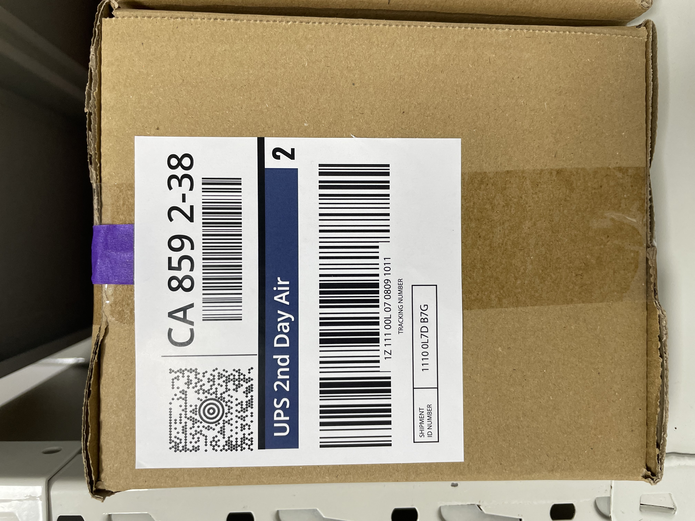

# UPS photo fixtures

**UPS Synthetic Shipping Label Dataset, Dynamsoft, 2025.** Creator: G (Dynamsoft).

These four photographs are from [Dynamsoft's synthetic dataset](https://github.com/Dynamsoft/datasets-from-dynamsoft/tree/654e7fa343bca0d19db349480e29cc176d36668a/UPS-Synthetic-Labels), licensed under [Creative Commons Attribution 4.0 International](https://creativecommons.org/licenses/by/4.0/). The publisher states that the labels do not represent real shipments or personal data. This is not an official UPS dataset or an endorsement of Liam Concierge.

Changes: source metadata, including GPS and camera details, was removed; only EXIF display orientation was retained. Decoded pixels were checked to remain identical. `manifest.json` records pinned source URLs, original and distributed SHA-256 hashes, attribution and expected tracking identifiers.

There are **four photos but only three distinct labels**: IMG_8745 and IMG_8760 show the same tracking number. Keep all photos of one label in the same split if these examples are ever used for training or prompt development. This is an exploratory regression collection, not an independent holdout or training run.

These labels intentionally have no visible recipient name, apartment or weight. Those fields must remain unknown; barcode payload metadata must not be passed off as visibly printed text. Intake must stay in review. Tracking numbers are synthetic and must never be used to create shipments or query a carrier.

| Image | Main challenge |
|---|---|
| [IMG_8743.JPG](IMG_8743.JPG) | Distinguish zero from letter O; separate tracking and routing codes |
| [IMG_8745.JPG](IMG_8745.JPG) | Box texture and multiple codes |
| [IMG_8746.JPG](IMG_8746.JPG) | Missing recipient fields and competing shipment ID |
| [IMG_8760.JPG](IMG_8760.JPG) | Curled label; second view of IMG_8745's label |

Original-resolution files are 4–6 MB each, exceeding the application's current 3 MB upload limit. They are benchmark inputs, not evidence that the upload UI accepts full-resolution phone photos. Orientation-aware image preparation remains an app improvement; do not silently increase upload limits.

Run `npm run eval:ocr` from the repository root after installing native Tesseract 5 with English and orientation-detection data. This benchmark runs locally and makes no model API calls. It scores printed tracking identifiers, not the complete intake flow. See [LABEL_DATASET.md](../../../LABEL_DATASET.md).
